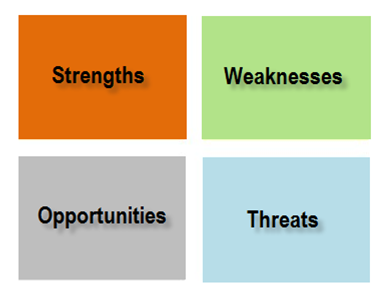

# Office of Transportation Planning at MassDOT
###David Mohler Executive Director

## Section 10: 2009 Transportation Reform Legislation

* Establishes an Office of Transportation Planning within MassDOT~
* Serves as principal source of transportation planning for state~
* Develops state's transportation-related programs outlined in Section 10 of Reform Legislation~

## OTP Mission

Conduct Rigorous, innovative ,and collaborative planning and technology transfer using the best data managment and analysis tools in order to move people and goods on a safe, efficient, and integrated transportation network, comply with federal and state regulations, and support vibrant communities.

## Why OTP is the first stop

* We provide objective and strategic thinking~
* We determine need and focus on an outcome~
* We are disciplined and mission driven~

## How we do bussiness

## Where are our mobility gaps and challenges as defined by our customers

* You Move Mass (phase 1) - Completed February '09~
* You Move Mass (phase 2) - Launching in September~

## How are we incorporating our visions and values into projects

* Route 28 Corridor Study

## What tools can we provide to better enable MassDOT to do its job

* Bi-weekly Active Construction Maps

## OTP Accountability

* Goal: Deliver superb customer service that both anticipates and responds to customer needs~
    * Performance Objective:  Identify strategies to better serve MassDOT's customers by enhancing existing transportation facilities and improving the Commonwealth's transportation infrastructure and operations~
    * Tactic: Conduct Roxbury/ Dorchester/ Mattapan Transit Needs Study~
    * Performance Measure:  How many minutes was the travel time improved to key destinations?~
* Goal: Invest public funds and other resources wisely fostering economic development wherever and whenever possible~
    * Performance Objective:  Use applied research to find solutions to technical problems confronting MassDOT~
    * Tactic: Solve specific transportation planning process challenges by accessing the technical knowledge and capabilities of public and private colleges and universities, including the delivery of short-term transportation planning efforts and literature reviews~
    * Performance Measure: Did any changes occur in a specific policy or practice resulting from the research findings?~

## Organizational Function

## Strategic Planning

* Strategic Transportation Plan~
* Capital Investment Plan~
* GreenDOT/ SmartGrowth~
* Freight Plan~
* Research~
* Bicycle/ Pedestrian Planning~

## Strategic Planning - Innovation Examples

* Diesel Multiple Units/ Commuter Rail white papers~
* Operational procurement decision-making guide~
* MassDOT sustainability and livability policy and framework~

## Project-Oriented Planning

* MPO Activities~
* Public Private Development~
* Discretionary Funding Programs (Safe Routes to School, TE, Scenic Byways)~
* CMAQ~
* Corridor/ Area Studies~
* Interchange/ Intersection/ Rotary Studies~

## Project-Oriented Planning-Critical Documents Delivered

* MPO Activities~
    * RTP (20-year plan and 4 year goals and objectives) +~
    * TIP (4 year spending plan, endorsed annually) =~
    * STIP (All TIPs combined and submitted to FHWA)~
* Corridor/ Area Studies~
    * Project and Policy Recommendations feed RTPs~

## Planning Analysis Tools

* Geographic Information System~
* Transportation Analysis~

## Planning Analysis Tools - Requirements Fulfilled by OTP

* Road Inventory File
    * Mileage certified annually to determine Federal funding for TIP~
    * Mileage delivered to FAPO to determine Chapter 90 municipal funding~

## Corridor/Area Studies

* Air Quality (Required for TIP)~
* Greenhouse gas emissions (DEP requirement)~

## SWOT Analyst

## Strengths

* Highly trained and motivated staff that is able to undertake complex tasks and deliver high quality products~
* Dedication to creative approaches and innovative solutions, while jettisoning obsolete practices~
* Willingness to focus on tasks that are central to MassDOT mission and abilities~

## Weaknesses

* Lack of asset management capabilities~
* Lack of resources (especially to fulfill requirements of Transportation Reform Law)~
* Inability to adequately reward or advance top-performers, lack of consequences for under-performers~
* Relience on outdated and obsolete software platforms, with no road map towards upgrading in a way that prevents future lock in~

## Opportunities

* Consolidation of metropolitan planning organizations and regional transit authorities~
* Objective analysis of state finances and review of expensive legacy projects~
* Improved access to state-of-the-art planning tools (e.g. web-based tools for GIS, data access, civic engagement)~
* Improved delivery, dissemination, and adoption of research materials and findings~
* Further consolidation of planning functions MassDOT-wide~

## Threats

* Financial constraints on capital and operating budgets~
* Unclear and cautious MassDOT decision-making~
* Influence of local elected officials on MassDOT decision-making~
* Upgrading our decade old software without a serious look at cheaper non microsoft alternatives~

## We Stand Ready to Serve

## Technology available at OTP

<video width="640px" height="480px" controls="controls">
  <source src="NewtonCornerTest.ogg" type="video/ogg" />
  <source src="NewtonCornerTest.webm" type="video/webm" />
   <source src="/NewtonCornerTest.mp4" type="video/mp4" />
   This presentation
   </video>
